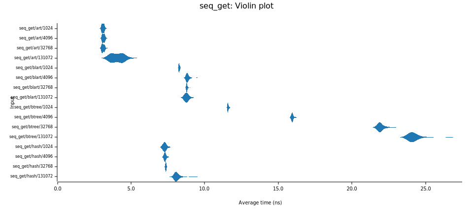

# Performance Analysis

This document summarizes the current benchmark profile of `rart` on the local benchmark machine. It
is intended as a companion to the README, with a little more detail and slightly more direct
discussion of tradeoffs.

## Test Environment

- Platform: NVIDIA GB10 (NVIDIA Spark equivalent, ASUS GX10 variant)
- CPU: ARM Cortex-X925 / Cortex-A725
- Architecture: aarch64 / ARMv9
- Benchmark framework: Criterion.rs for workload benchmarks, `micromeasure` for internal
  microbenchmarks
- Profile: quick/default benchmark profile (`RART_BENCH_FULL` unset)

These results should be read as a machine-specific performance profile, not a universal ranking.

## Executive Summary

`rart` is strongest when keys have structure and you can make use of that structure:

- exact lookup with ordered semantics
- longest-prefix match
- prefix-aware filtering and subtree traversal
- low-overlap joins / intersections where whole subtrees can be pruned

It is weaker when the workload looks more like a generic container benchmark:

- full-key iteration over the whole map
- broad prefix enumeration
- high-overlap joins where merge-style scans win

The versioned tree shows a similarly clear split:

- strong on persistent lookup and sequential scan
- weaker than `imbl` on mutation-heavy snapshot workloads

## Comparison Baselines

Single-threaded comparisons in this document refer to:

- `HashMap`: `std::collections::HashMap`
- `BTreeMap`: `std::collections::BTreeMap`
- `BLART`: the external `blart` crate

Versioned comparisons refer to the `imbl` crate:

- `imbl::HashMap`
- `imbl::OrdMap`

## AdaptiveRadixTree

### Strengths

#### Point Lookup

Point lookup is one of the clearest wins for `rart` on this machine.

- `seq_get` at `1024`
  - `rart`: `3.1ns`
  - `HashMap`: `7.3ns`
  - `BLART`: `8.3ns`
  - `BTreeMap`: `11.6ns`
- `seq_get` at `32768`
  - `rart`: `3.1ns`
  - `HashMap`: `7.4ns`
  - `BLART`: `8.8ns`
  - `BTreeMap`: `21.9ns`

That is the profile you would hope for from a well-tuned ART: lookup driven by key bytes and hot
upper-level prefixes, rather than comparison-heavy tree descent.

#### Inserts

Sequential insert is competitive with `HashMap` and clearly ahead of `BTreeMap` here.

- `seq_insert`
  - `rart`: `33.4ns`
  - `HashMap`: `34.3ns`
  - `BTreeMap`: `43.6ns`
  - `BLART`: `107.1ns`

#### Prefix-Structured Querying

This is one of `rart`'s real differentiators.

- `longest_prefix_match` at `32768`
  - `rart`: `1.83ms`
  - `HashMap`: `1.23ms`
  - `BTreeMap`: `6.78ms`

The hash baseline is still very fast because it is doing repeated exact lookups on shorter keys, but
`rart` is much faster than the ordered-map baseline while supporting this as a native tree
operation.

#### Low-Overlap Intersections

Low-overlap prefix-aware joins are another genuine ART strength.

- `n100000/o10`
  - `intersect_count`: `54.5us`
  - `intersect_with`: `64.1us`
  - `BTreeMap` merge join: `133.8us`

When leading prefixes diverge early, `rart` can skip large parts of the search space. This is one of
the places where a radix layout can do less work than a generic ordered merge.

### Weaknesses

#### Full-Key Iteration

This remains the main weak point.

- Full iteration at `32768`
  - `rart`: `310.0us`
  - `BLART`: `61.8us`
  - `BTreeMap`: `29.1us`
  - `HashMap`: `20.5us`

The cost here is key discovery and reconstruction from compressed paths. `rart` is optimized much
more for externally supplied key probes than for “walk the whole structure and rebuild every key”.

BLART is noticeably better on iteration. The likely reason is a different layout tradeoff that is
more iteration-oriented. This document does not claim a proven internal cause, only that the current
numbers are consistent with BLART paying some cost elsewhere to make scans cheaper.

#### Broad Prefix Enumeration

Prefix iteration is highly workload-shaped.

At `32768` keys:

- Narrow prefixes
  - `rart`: `587.5us`
  - `BTreeMap`: `121.6us`
  - `HashMap`: `93.07ms`
- Medium prefixes
  - `rart`: `16.67ms`
  - `BTreeMap`: `893.3us`
  - `HashMap`: `93.80ms`

So `rart` is dramatically better than full-map hash scans for prefix work, but `BTreeMap` still wins
this benchmark on this machine.

#### High-Overlap Intersections

When overlap is high, the prefix-pruning advantage mostly disappears.

- `n100000/o90`
  - `intersect_count`: `504.1us`
  - `intersect_with`: `580.1us`
  - `BTreeMap` merge join: `178.4us`

In that regime, ordered merge joins are simply a better fit.

### Traversal APIs: Owned vs Lending

The owned traversal APIs pay for key materialization. That is the main reason full traversal is more
expensive than the point-lookup story would suggest.

For perf-sensitive traversal, the lending callback APIs are the preferred surface:

- `for_each_view`
- `prefix_for_each_view`
- `for_each_range_view`
- `with_longest_prefix_match_view`
- `intersect_lending_with`

Those APIs remove per-item owned-key materialization and materially improve traversal:

- Full traversal at `32768`
  - owned: `587.8us`
  - lending: `223.0us`
- Range traversal at `32768`
  - owned: `297.8us`
  - lending: `147.9us`
- Narrow prefix traversal at `32768`
  - owned: `591.8us`
  - lending: `217.4us`
- Longest-prefix match at `1024`
  - owned: `51.8us`
  - lending: `36.0us`

The key point is that `rart` now has two traversal stories:

- owned APIs for ergonomic key materialization
- lending APIs for performance-sensitive consumers that can handle keys inside a callback

### Value-Only Iteration

If you only need values, `values_iter()` is much cheaper than full iteration:

- `values_iter` at `32768`
  - `rart values_iter`: `83.4us`
  - `rart full iteration`: `313.2us`
  - `BLART`: `62.6us`
  - `BTreeMap`: `29.3us`
  - `HashMap`: `19.9us`

That does not make `rart` the fastest scanner, but it is a meaningful improvement over rebuilding
every key during traversal.

## VersionedAdaptiveRadixTree

The versioned tree is read-leaning: strong for persistent lookup and sequential scanning, less
competitive for mutation-heavy snapshot workloads.

### Strengths

#### Persistent Lookup

At `16384` elements:

- versioned `rart`: `15.1ns`
- `imbl::HashMap`: `23.4ns`
- `imbl::OrdMap`: `38.6ns`

That is a clear win for lookup-heavy persistent workloads.

#### Sequential Scan

At `16384` elements:

- versioned `rart`: `126.2us`
- `imbl::HashMap`: `191.2us`
- `imbl::OrdMap`: `470.3us`

The radix layout is helping here as well.

### Weaknesses

#### Mutation Bursts Per Snapshot

At `100` mutations per snapshot:

- versioned `rart`: `102.8us`
- `imbl::HashMap`: `58.1us`
- `imbl::OrdMap`: `35.5us`

#### Structural Sharing With Repeated Small Mutations

At `10` snapshots:

- versioned `rart`: `102.8us`
- `imbl::HashMap`: `37.0us`
- `imbl::OrdMap`: `24.8us`

So the versioned tree is not currently the best choice for highly mutation-heavy persistent
workloads. The trade is clearly tilted toward read and scan performance.

### Optional Arc Backend

The `triomphe-arc` feature swaps `std::sync::Arc` for `triomphe::Arc` in the versioned tree.

In local `versioned_tree_bench` runs on this machine, that improved mutation and
snapshot-sharing-heavy workloads by roughly `2-4%`, while lookup and sequential scan stayed close to
flat.

## Practical Recommendations

### Choose `rart` when

- exact lookup speed matters and you still need order
- your application logic is organized around shared prefixes
- you need longest-prefix match, prefix subtree iteration, or prefix-aware joins
- your intersections are often sparse or low-overlap
- you can use the lending traversal callbacks for hot traversal paths

### Choose `BTreeMap` when

- broad ordered scans dominate
- range iteration is the primary bottleneck
- you do not need trie-native prefix behavior

### Choose `HashMap` when

- exact-match lookup is all you need
- ordering and prefix semantics do not matter
- full scans are uncommon or unimportant

### Choose `VersionedAdaptiveRadixTree` when

- persistent lookups and scans dominate
- you want structural sharing with ordered, prefix-aware semantics
- snapshotting matters more than repeated write-heavy fan-out

### Choose `imbl` when

- persistent mutation bursts dominate
- snapshot-sharing-heavy write loops are the hot path
- the best mutation latency matters more than trie-native lookup or scan behavior

## Closing Read

`rart` is not trying to be “the fastest map at everything”. Its strength is the combination of:

- very fast ordered lookup
- native prefix operations
- meaningful wins on prefix-structured joins
- a versioned tree that is read-strong rather than mutation-strong

On this ARM64 box, that profile comes through clearly in the benchmarks.
