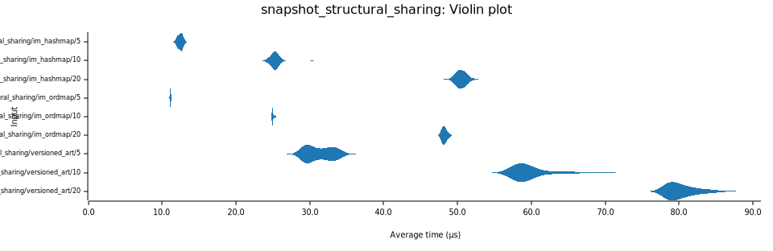

# Benchmarks analysis

## Test Environment

**System Specifications:**

- **Platform**: NVIDIA GB10 (NVIDIA Spark equivalent, ASUS GX10 variant)
- **CPU**: ARM Cortex-X925 / Cortex-A725 (20 cores)
- **Architecture**: aarch64 (ARMv9)
- **Memory**: High-bandwidth memory (HBM3/LPDDR5X class)

**Bench Framework**: Criterion.rs statistical benchmarking
**Run Profile**: Quick profile (`RART_BENCH_FULL` unset; shorter sample/warmup/measurement windows). Use `RART_BENCH_FULL=1` for longer high-confidence runs.

## Executive Summary

This analysis compares three data structures across different access patterns:

- **ART (Adaptive Radix Tree)** - Our implementation
- **BTree** - Rust std::collections::BTreeMap
- **HashMap** - Rust std::collections::HashMap

## Key Performance Findings

### Random Insert Performance

**Results (nanoseconds per operation):**

- **HashMap: 140ns** (fastest)
- **ART: 326ns** (2.3x slower than HashMap)
- **BTree: 412ns** (2.9x slower than HashMap)

**Analysis**: HashMap's hash-based direct addressing dominates random insertions. ART remains ahead of BTree in this benchmark.

---

### Random Get Performance

**Results for 32k elements:**

- **HashMap: 18ns** (fastest)
- **ART: 19ns** (comparable to HashMap)
- **BTree: 56ns** (3x slower)

**Results for 131k elements:**

- **HashMap: 24ns** (fastest)
- **ART: 40ns** (slower than HashMap at scale)
- **BTree: 75ns** (slowest, 1.9x slower than ART)

**Analysis**: HashMap is fastest for random access. ART remains competitive on smaller datasets and stays ahead of BTree here, but random access at scale favors HashMap.

---

### Sequential Key Lookup Performance

**Results for 32k elements:**

- **ART: 1.6ns** (4.6x faster than HashMap, 13x faster than BTree)
- **HashMap: 7.4ns** (solid performance)
- **BTree: 22.2ns** (slowest)

**Analysis**: ART is very fast for ordered key probes supplied by the caller. Prefix compression and cache-local traversal keep upper nodes hot for repeated lookups.

*Note: This measures lookup speed for **externally supplied keys**, distinct from Iteration (discovering keys from the tree structure).*

---

### Sequential Delete Performance

**Results:**

- **BTree: 19.8ns** (fastest for deletion)
- **ART: 27.1ns** (runner-up)
- **HashMap: 31.2ns**

**Analysis**: BTree's balanced structure excels at deletions. In this run, ART was faster than HashMap for sequential deletes.

---

### Random Delete Performance

**Results:**

- **HashMap: 79ns** (fastest)
- **ART: 298ns** (3.8x slower than HashMap)
- **BTree: 329ns** (4.2x slower than HashMap)

**Analysis**: HashMap leads random deletion by a wide margin in this run. ART and BTree both trail significantly.

---

### Iteration Performance

While ART excels at **sequential key lookup** (cache-friendly access to externally supplied keys), its **iteration** performance (traversing the tree structure to discover keys) currently trails BTree and HashMap.

This distinction is critical:
- **Sequential Lookup**: Fast because common prefixes keep upper nodes in CPU cache.
- **Iteration**: Slower because it involves traversing complex adaptive nodes and reconstructing keys from path compression, which is more expensive than BTree's linked leaf traversal.

**Full Iteration (32k elements):**

- **HashMap: ~20.2µs** (~0.62ns/element)
- **BTree: ~28.3µs** (~0.86ns/element)
- **ART: ~268.3µs** (~8.2ns/element)

**Value-only Iteration (32k elements, `values_iter`):**

- **HashMap: ~20.5µs** (~0.63ns/element)
- **BTreeMap: ~28.5µs** (~0.87ns/element)
- **BLART: ~64.1µs** (~1.96ns/element)
- **ART: ~67.1µs** (~2.05ns/element)

**Observation**:
- `values_iter` removes key reconstruction overhead and is ~4x faster than ART full iteration in this run.
- Recent sparse-iterator changes for Node48/Node256 improved ART value-only iteration by about 10-14% versus the previous local baseline.

**Range Iteration (scanning ~1k elements in 4k tree):**

- **BTree: ~3.8µs**
- **ART: ~39.6µs** (10x slower)

**Recent Improvements**:
Recent optimizations have improved range iteration performance by ~40% (down from ~66µs), and full start-bound seeking is now implemented. However, a performance gap remains compared to BTree's highly optimized leaf traversal.

**Implication**:
- **Use `seq_get` (Sequential Get)** for ordered probes over externally supplied keys; ART is fastest in this benchmark (~1.6ns/op).
- **Use `iter()`** if you need to discover keys, but be aware of the higher cost (~8.2ns/op).
- For workloads primarily dominated by *ordered range scans*, BTree currently retains an advantage.

## Performance Characteristics by Use Case

| Operation              | Winner                  | Runner-up      | Performance Gap |
| ---------------------- | ----------------------- | -------------- | --------------- |
| **Random Insert**      | HashMap (140ns)         | ART (326ns)    | 2.3x faster     |
| **Random Get (Small)** | HashMap (18ns)          | ART (19ns)     | Comparable      |
| **Random Get (Large)** | HashMap (24ns)          | ART (40ns)     | 1.7x faster     |
| **Sequential Key Lookup**| **ART (1.6ns)**         | HashMap (7.4ns)| **4.6x faster** |
| **Sequential Delete**  | BTree (19.8ns)          | ART (27.1ns)   | 1.4x faster     |
| **Random Delete**      | HashMap (79ns)          | ART (298ns)    | 3.8x faster     |
| **Iteration**          | HashMap (~0.62ns)       | BTree (~0.86ns)| ART is slower (~8.2ns) |

## Recommendations by Workload

### **Choose ART when:**

- You need **ordered keys** (sorted iteration/range semantics), which `HashMap` does not provide
- **Sequential key lookup** dominates (accessing known keys in order)
- Mixed read/write workloads where order matters
- Predictable performance is critical
- Memory efficiency matters

### **Choose HashMap when:**

- Random insert-heavy workloads
- Pure random access is the primary bottleneck
- Iteration speed is critical (unordered)
- Maximum raw insert speed needed

### **Choose BTree when:**

- Sequential delete-heavy workloads
- Strict worst-case bounds are required
- Range queries and ordered iteration are the primary bottlenecks

## Technical Insights

### ART's Sequential Key Lookup Advantage

The 4.6x performance improvement in sequential lookups (1.6ns vs 7.4ns) reflects ART's core strength: prefix compression creates cache-friendly access patterns when keys share common prefixes. This applies when keys are provided to the `get()` method.

### HashMap's Insert Dominance

HashMap's insert advantage comes from O(1) hash-based addressing, avoiding tree traversal costs entirely.

### BTree's Deletion Efficiency

BTree's balanced structure provides predictable deletion performance through established rebalancing algorithms.

### Scaling Characteristics

- **ART**: Good scaling with dataset size due to radix structure, though random access can be sensitive to depth.
- **HashMap**: Best for random access at scale, provided hash function quality is good.
- **BTree**: Logarithmic scaling, consistent but generally slower than ART/HashMap for lookups.

## Conclusion

**ART provides an ordered alternative with strong lookup performance**, offering:

- **Very fast sequential lookup performance (1.6ns)**
- **Competitive random access**, often matching HashMap for small sets
- **Faster than BTree** for most operations except sequential delete
- **Ordered iteration** capabilities lacking in HashMap

---

## Versioned Adaptive Radix Tree Performance Analysis

The **VersionedAdaptiveRadixTree** provides concurrent versioned capabilities with copy-on-write semantics. The following sections compare it against persistent data structures from the `im` crate:

- **im::HashMap** - Hash Array Mapped Trie (HAMT) with structural sharing
- **im::OrdMap** - B-tree implementation with structural sharing

### Versioned Tree Lookup Performance

**Results across different dataset sizes:**

| Dataset Size | VersionedART | im::HashMap | im::OrdMap | Winner       | Performance Gap |
| ------------ | ------------ | ----------- | ---------- | ------------ | --------------- |
| 256          | 8.9ns        | 18.8ns      | 17.4ns     | VersionedART | 2.0-2.1x faster |
| 1,024        | 15.8ns       | 23.5ns      | 18.5ns     | VersionedART | 1.2-1.5x faster |
| 4,096        | 13.9ns       | 22.1ns      | 26.1ns     | VersionedART | 1.6-1.9x faster |
| 16,384       | 16.4ns       | 28.5ns      | 32.0ns     | VersionedART | 1.7-1.9x faster |

**Analysis**: VersionedART consistently outperforms `im` collections for lookups across all dataset sizes. The radix tree structure allows for very fast path traversal even with the overhead of versioning.

---

### Versioned Tree Sequential Scanning

**Results for sequential access patterns:**

| Dataset Size | VersionedART | im::HashMap | im::OrdMap | Performance Advantage |
| ------------ | ------------ | ----------- | ---------- | --------------------- |
| 256          | 1.0µs        | 1.9µs       | 2.7µs      | 1.9x faster           |
| 1,024        | 6.2µs        | 8.6µs       | 13.3µs     | 1.4x faster           |
| 4,096        | 32.8µs       | 39.5µs      | 77.4µs     | 1.2x faster           |
| 16,384       | 122µs        | 209µs       | 398µs      | 1.7x faster           |

**Analysis**: In this run, VersionedART is faster than both `im::HashMap` and `im::OrdMap` for sequential scans, with up to about 2x improvement depending on dataset size.

---

### Snapshot Creation Performance

**O(1) Snapshot Creation (nanoseconds):**

| Dataset Size | VersionedART Snapshot | im::HashMap Clone | im::OrdMap Clone | Advantage                |
| ------------ | --------------------- | ----------------- | ---------------- | ------------------------ |
| 256          | 8.6ns                 | 16.2ns            | 8.6ns            | 1.9x faster than HashMap |
| 16,384       | 8.6ns                 | 16.2ns            | 8.5ns            | 1.9x faster than HashMap |

**Analysis**: VersionedART provides O(1) snapshots with consistent ~8.6ns performance, matching `im::OrdMap` and outperforming `im::HashMap` clone time in this benchmark.

---

### Multi-Mutation Transactional Workloads

**Multiple mutations per snapshot (microseconds):**

| Mutations | VersionedART | im::HashMap | im::OrdMap | Trade-off Analysis       |
| --------- | ------------ | ----------- | ---------- | ------------------------ |
| 10        | 21.7µs       | 7.1µs       | 4.9µs      | im types 3-4x faster     |
| 50        | 66.4µs       | 36.2µs      | 25.3µs     | im types 1.8-2.6x faster |
| 100       | 106.3µs      | 72.1µs      | 51.4µs     | im types 1.5-2.1x faster |
| 200       | 243.3µs      | 146.0µs     | 107.1µs    | im types 1.4-2.3x faster |

**Analysis**: The `im` types perform better for mutation-heavy workloads. VersionedART's CoW radix tree approach has more overhead for write-heavy scenarios.

---

### Structural Sharing Efficiency

**Multiple snapshots with small mutations (microseconds):**

| Snapshots | VersionedART | im::HashMap | im::OrdMap | Memory Efficiency                   |
| --------- | ------------ | ----------- | ---------- | ----------------------------------- |
| 5         | 51.9µs       | 22.4µs      | 19.9µs     | Lower latency vs shared structure   |
| 10        | 103.4µs      | 44.6µs      | 40.0µs     | 2.3x latency for structural sharing |
| 20        | 124.7µs      | 89.5µs      | 80.4µs     | 1.4x latency for structural sharing |

**Analysis**: Similar to mutation workloads, `im` types show lower latency. VersionedART trades higher mutation/snapshot latency for stronger read/scan performance.

---

## Performance Characteristics Summary

### VersionedAdaptiveRadixTree Advantages:

✅ **Faster lookup performance in this benchmark** (1.2x - 1.8x faster than `im` types)\
✅ **Faster sequential scanning in this benchmark** (up to 2x faster)\
✅ **Fast O(1) snapshots** (~8.6ns)\
✅ **Safe structural sharing** for concurrent access\
✅ **Optimized for read-heavy workloads**

### VersionedAdaptiveRadixTree Disadvantages:

❌ Higher mutation overhead compared to highly optimized `im` persistent structures\
❌ Higher latency when heavily utilizing structural sharing in write-heavy loops

---

## Workload Recommendations

### **Choose VersionedAdaptiveRadixTree when:**

- **Read-heavy versioned workloads** dominate
- **Sequential access and range scans** are frequent
- **Snapshot creation** is frequent but mutations per snapshot are moderate
- **Concurrency** requires safe, isolated views of data

### **Choose im::HashMap when:**

- **Write-heavy** transactional workloads
- **Pure random access** is the primary pattern
- **Ordering is not required**

### **Choose im::OrdMap when:**

- **Write-heavy** ordered workloads
- **Balanced read/write** performance is needed
- **Mutation latency** is the critical metric

---

_Analysis generated from Criterion.rs benchmarks on NVIDIA GB10 (NVIDIA Spark equivalent, ASUS GX10 variant) (ARM Cortex-X925)_
